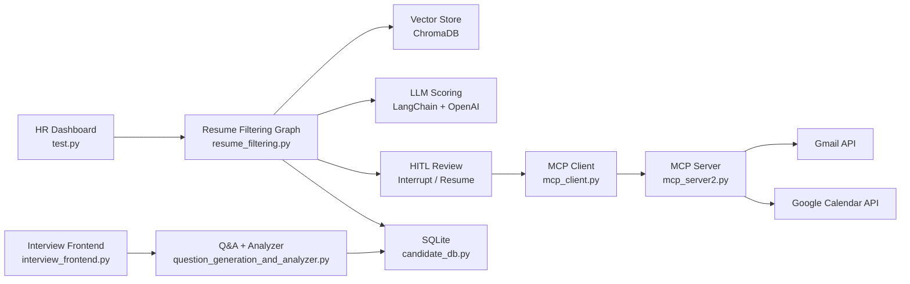

# Resume-Filtering-Agent


AI-powered HR recruitment system built with **LangGraph**, **Streamlit**, and **MCP integrations**.

From resume screening to interview orchestration, this project combines LLM-driven scoring, human-in-the-loop controls, email automation, and calendar booking in one workflow.

---

## Why this project?

Hiring teams often struggle with:
- manual resume shortlisting,
- inconsistent candidate evaluation,
- repetitive interview coordination,
- poor visibility across candidate stages.

This project solves that by creating a structured AI workflow with human approval where needed.

---

## Core Features

- **JD-based Resume Scoring** with vector similarity + LLM structured evaluation
- **Human-in-the-Loop (HITL)** review using LangGraph interrupt/resume flow
- **Interview Invite Automation** via Gmail MCP tools
- **Google Calendar Integration** for free-slot discovery and meeting booking
- **Token-based Interview Links** for candidate-specific interview sessions
- **Interview Analysis + Status Updates** stored in SQLite
- **Dashboard-first Operations** through Streamlit UI

---

## Architecture (High Level)

1. HR uploads resumes + JD in dashboard
2. Resumes are parsed, embedded, and ranked
3. LLM returns structured score + feedback
4. Human reviewer can refine/override decisions
5. MCP tools send emails / fetch slots / book meetings
6. Candidate status and interview outcomes persist in DB



---

## Tech Stack

- **Python**
- **Streamlit** (UI)
- **LangGraph** (workflow + HITL state transitions)
- **LangChain + OpenAI** (LLM + embeddings)
- **ChromaDB** (vector retrieval)
- **FastMCP** (tool server/client for Gmail + Calendar)
- **SQLite** (candidate lifecycle data)

---

## Project Structure

- `test.py` — main Streamlit HR dashboard
- `resume_filtering.py` — resume filtering graph, HITL, tool-loop orchestration
- `question_generation_and_analyzer.py` — interview question flow + final analysis
- `interview_frontend.py` — candidate interview interface
- `mcp_server2.py` — MCP server (Gmail + Calendar + token tools)
- `mcp_client.py` — MCP client wrappers used by dashboard/workflow
- `candidate_db.py` — SQLite schema + helper functions
- `resumes/` — sample resumes for local testing
- `db/` — local vector/database artifacts

---

## Quick Start

### 1) Clone and create virtual environment

```bash
git clone https://github.com/DevForge255/Resume-Filtering-Agent.git
cd Resume-Filtering-Agent
python -m venv venv
source venv/bin/activate
```

### 2) Install dependencies

```bash
pip install -r requirements.txt
```

> If `requirements.txt` is not present in your local copy, install packages from your existing environment first and generate one using `pip freeze > requirements.txt`.

### 3) Configure local secrets (do not commit)

Create local files:
- `.env`
- `credentials.json`
- `token.json` (generated after OAuth flow)

Expected `.env` keys:

```env
OPENAI_API_KEY=your_openai_key
```

### 4) Run apps

HR dashboard:

```bash
streamlit run test.py
```

Interview frontend:

```bash
streamlit run interview_frontend.py
```

---

## Security & Git Hygiene

This repository is configured to prevent secret leakage.

Ignored locally:
- `.env`
- `credentials.json`
- `token.json`
- `tokens/`
- local DB artifacts (`db/*.db`, sqlite files)

If you accidentally commit secrets, rotate them immediately and rewrite git history before pushing.

---

## Demo Checklist (for recruiters / showcase)

- Upload 3–5 sample resumes and one JD
- Show shortlist + score cards
- Trigger interview invite email flow
- Show free-slot fetch + booking action
- Run interview frontend with token and show analysis output

---

## Roadmap

- Add CI checks (lint + smoke tests)
- Add Dockerized local setup
- Add role-based dashboard views (HR/Admin)
- Add analytics panel for hiring funnel metrics

---

## License

MIT License
